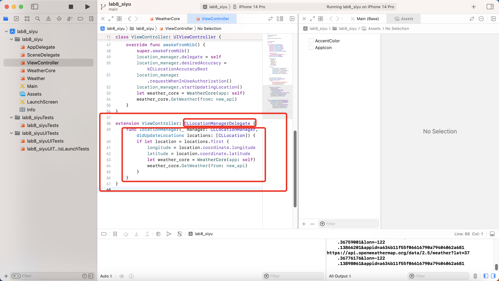

# PROG8470-IOS-Lab8-Weather-API

Lab8 SPA project of PROG8470 IOS development of Conestoga College. This app uses GPS to simulate location, and use the location to generate http request and send to OpenWeather, after getting the json response, use it to set view of screen.

## Running Result

## Set GPS delegate

use extension this time. This time to simulate location should use none or custom location.

## Prepare API params

The new API is a computed property, it consist of latitude, longtitude and api key

## Send request and Decode json

datatask will execute the code asynchronously. weather property has set didSet, every time it is changed, it will set the UIViews.

